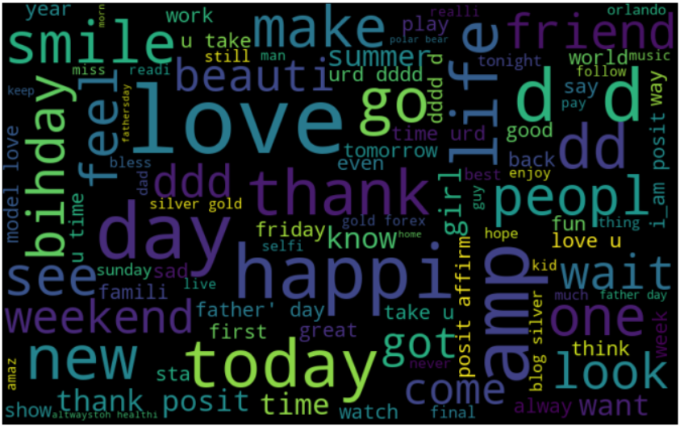
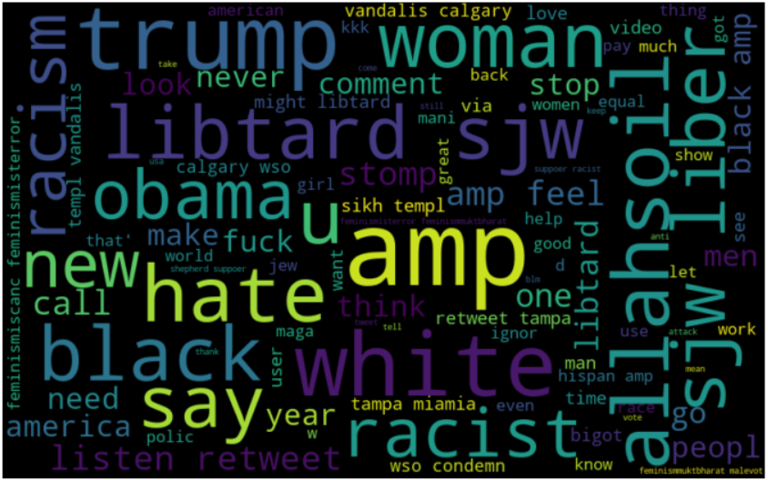

# Twitter-Sentiment-Analysis-Hate-Speech-Detection
## Detection of hate speech using Twitter dataset by leveraging term frequency-inverse document frequency (TFIDF) values to multiple machine learning models.

According to Wikipedia, hate speech is defined as “any speech that attacks a person or group on the basis of attributes such as race, religion, ethnic origin, national origin, gender, disability sexual orientation, or gender identity.” As hate speech continues to be a societal problem, the need for automatic hate speech detection systems becomes more apparent. This repository proposes a solution to the detection of hate speech on Twitter through machine learning using TF IDF values.

## Overview
TFIDF is a numerical statistic that is intended to reflect how important a word is to a document in a collection. It is used as a weighting factor in searches of information retrieval, text mining, and user modeling.

Before we input this data into various algorithms, we have to clean it as the tweets contain many different tenses, grammatical errors, unknown symbols, hashtags, and Greek characters.

We tackle this problem by employing lemmatization, stemming, removal of stop words, and omissions. Lemmatization removes the inflectional endings of words and returns the word to the base or dictionary form of it itself. Stemming is similar to lemmatization in that it reduces the inflected or derived words to their word stem. A stop word is a commonly used word, such as “the”, “a”, “an”, “in”, that we programmed to ignore as it holds no importance. The last step is to omit any foreign characters and Greek symbols.

## TFIDF
TFIDF is an information retrieval technique that weighs a term’s frequency (TF) and its inverse document frequency (IDF). Each word or term has its respective TF and IDF score. The product of the TF and IDF scores of a term is called the TFIDF weight of that term. Put simply, the higher the TFIDF score (weight), the rarer the term and vice versa.

The TFIDF algorithm is used to weigh a keyword in any content and assign the importance to that keyword based on the number of times it appears in the document. More importantly, it checks how relevant the keyword is throughout the web, which is referred to as corpus.

For a term t in a document d, the weight Wt, d of term t in document d is given by:
Wt, d = TFt, d log (N/DFt) where,

* TFt, d is the number of occurrences of t in document d. 
* DFt is the number of documents containing the term t. 
* N is the total number of documents in the corpus. 

The IDF (inverse document frequency) of a word is the measure of how significant that term is in the whole corpus.

## Machine Learning Models
The classifier model trained using term-frequency-inverse document frequency (TFIDF) as features. A comparative analysis of the results was performed using Random Forest Classifier, Logistic Regression, and Naive Bayes.

#### Upon running the classification algorithms, the following results were obtained:
| Algorithm             | F1 score |
| :------------------   | :--------|
| Random Forest         | 0.96     |
| Logistic Regression   | 0.95     |
| Naive Bayes           | 0.94     |

## Sneak Peeks
#### A word cloud is created to get an idea of the most common words utilized in tweets. This was done for both categories of hate and non-hate tweets.

### Positive tweets

### Negative tweets

